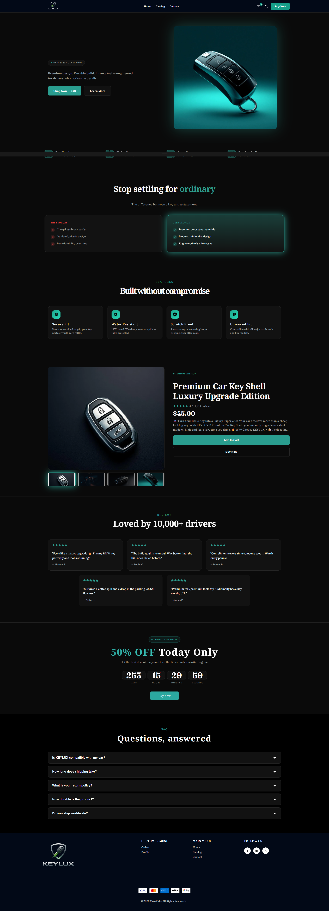

# Key Lux - Premium Shopify Landing Page

A luxurious, high-converting Shopify landing page built on the high-performance **Ella Theme (v6.7.6)**. Designed for premium brands that demand visual excellence and superior user experience.

## ✨ Features

- **Modern & Premium Design**: Minimalist yet impactful aesthetics tailored for luxury brands.
- **Shopify OS 2.0 Compatible**: Built with the latest Shopify architecture, allowing for modular section-based customization.
- **High Performance**: Optimized for fast loading speeds and smooth transitions.
- **Multi-Layout Support**: Includes various layouts for Collections, Products, and Blogs.
- **Advanced UI Components**: 
  - Dynamic Mega Menus
  - Quick Shop Popups
  - Advanced Product Filters
  - Sticky Notifications
  - Interactive Swatches

## 🚀 Getting Started

### Prerequisites
- A Shopify Store
- Access to the Shopify Admin

### Installation
1. Clone this repository or download the ZIP file.
2. Log in to your Shopify Admin.
3. Go to **Online Store > Themes**.
4. Click **Add Theme > Upload zip file**.
5. Upload the theme files and click **Actions > Publish** when ready.

## 🛠️ Customization

This landing page is highly customizable via the Shopify Theme Editor:
- **Theme Settings**: Configure typography (Jost & Google Fonts), color palettes, and global layouts in `config/settings_schema.json`.
- **Sections**: Add, reorder, and remove sections directly from the Shopify customizer.
- **JSON Templates**: All templates are JSON-based for maximum flexibility.

## 📂 Project Structure

- `/assets`: Contains theme-specific images, CSS, and JS.
- `/sections`: Modular Liquid components for page layouts.
- `/snippets`: Reusable code blocks for consistent UI elements.
- `/templates`: JSON and Liquid templates for various page types.
- `/config`: Theme configuration and schema definitions.

## 💎 Under the Hood

- **Base Theme**: Ella v6.7.6 by Halothemes
- **Frameworks**: Shopify Liquid, Vanilla JavaScript, SCSS
- **Typography**: Jost (Google Fonts)

---

Developed with ❤️ by **Jakir Hossen**
